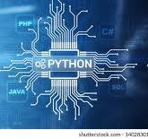

## Raphael Andrade
## Conecte-se comigo

## Habilidades

[]

## GitHub Stats

## Minha História
 
Me Chamo Raphael tenho,36 anos e sou residente do interior do Rio de Janeiro, minha area antiga de trabalho era mixologia, onde atuei durante algum tempo. Sempre fui desinteressado pelo campo technologico, há alguns meses atrás comecei a me interessar e conhecer este imenso mundo, e as tecnologias ao qual tenho ficado entusiasmado pelo conhecimento, ainda encontro algumas dificuldades, mais aos poucos tenho me esforçado para compreender e entender sobre o assunto e tenho gostado. Apesar de ainda estar buscando um caminho a seguir, iniciei um curso em dev Python backend e o versionamento de codigo.